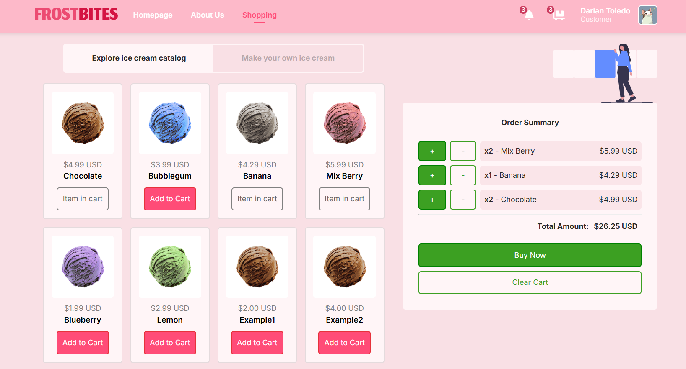

<h1></h1>


## About

FrostBites is a full-stack web application developed as part of my project at SENA
Institution. Designed with both user convenience and functionality in mind, the
application showcases a practical implementation of modern web development principles.
This project really helped me sharpen my skills in building applications that are secure,
user friendly, and built to last

## Features

#### Authentication

- [x] Secure login/registration
- [x] Email verification
- [x] Password reset & validation
- [x] 1-hour session expiry
- [ ] Persistent sessions

#### E-Commerce

- [x] Product catalog
- [ ] Custom product builder
- [x] Shopping cart & checkout
- [x] Order confirmation

#### User Profile

- [x] Profile management
- [x] Data validation
- [ ] Preferences (dark mode, etc.)

#### Admin Panel

- [x] Admin authentication
- [x] Product management (CRUD operations)
- [x] Site statistics

#### Other Features

- [x] Google Maps integration
- [x] Secure authentication (bcrypt)
- [x] Error handling
- [x] Mobile responsiveness
- [ ] Multilingual support
- [ ] Performance optimization

## Tech Stack

- **Frontend:** React.js (deployed on Vercel)
- **Backend:** Express.js (deployed on Render)
- **Database:** PostgreSQL (hosted on Supabase)

## Getting Started

To run this project locally:

```shell
git clone https://github.com/darianmorat/frostbites.git
cd frostbites && npm install
cd client && npm install
npm run dev
```

## License

Contributions are welcome!  
Feel free to fork the repository, suggest improvements, or submit pull requests

© 2025 FrostBites
