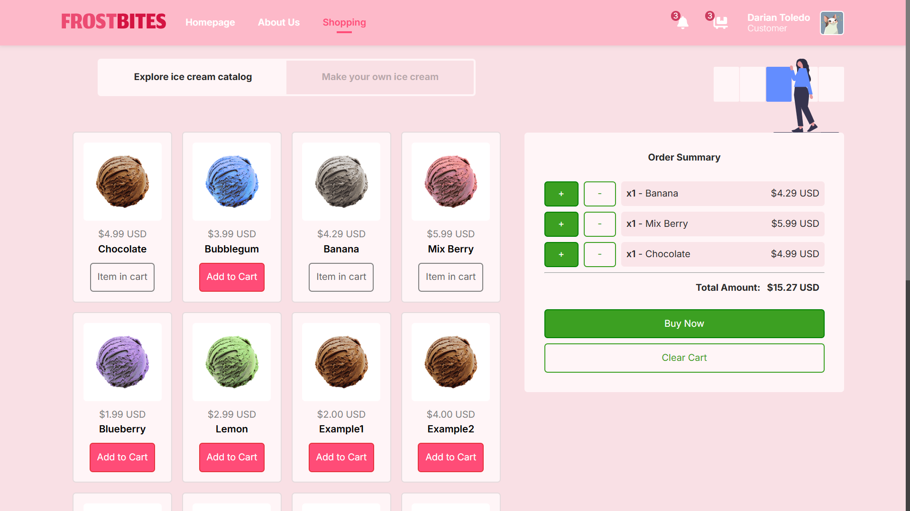
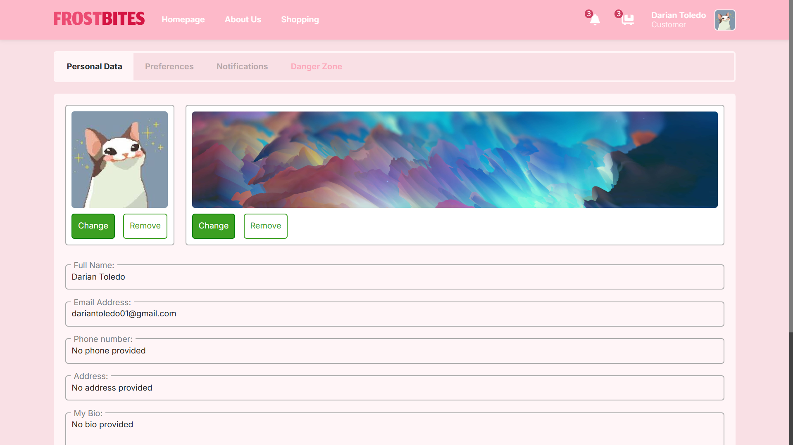

<div align="center">
   
</div>

## About

FrostBites is a full-stack e-commerce platform for ice cream products. The system provides
customers with secure order processing, account management, and personalized shopping
experiences, while offering administrators comprehensive tools for inventory control,
sales analytics, and business operations through an intuitive interface.

## Preview

<details>
   <summary>View screenshots <small style="color: #888;">(click to expand)</small></summary>
   <div align="center" style="margin-top: 16px;">
      
      
   </div>
</details>

## Features

#### Authentication

- [x] Secure login/registration
- [x] Email verification
- [x] Password reset & validation
- [x] 1-hour session expiry
- [ ] Persistent sessions

#### E-Commerce

- [x] Product catalog
- [ ] Custom product builder
- [x] Shopping cart & checkout
- [x] Order confirmation

#### User Profile

- [x] Profile management
- [x] Data validation
- [ ] Preferences (dark mode, etc.)

#### Admin Panel

- [x] Admin authentication
- [x] Product management (CRUD operations)
- [x] Site statistics

#### Other Features

- [x] Google Maps integration
- [x] Secure authentication (bcrypt)
- [x] Error handling
- [x] Mobile responsiveness
- [ ] Multilingual support
- [ ] Performance optimization

## Tech Stack

- **Frontend:** React.js (deployed on Vercel)
- **Backend:** Express.js (deployed on Render)
- **Database:** PostgreSQL (hosted on Supabase)

## Getting Started

To run this project locally:

```shell
git clone https://github.com/darianmorat/frostbites.git
cd frostbites && npm install
cd client && npm install
npm run dev
```

## License

Contributions are welcome!  
Feel free to fork the repository, suggest improvements, or submit pull requests

© 2025 FrostBites
